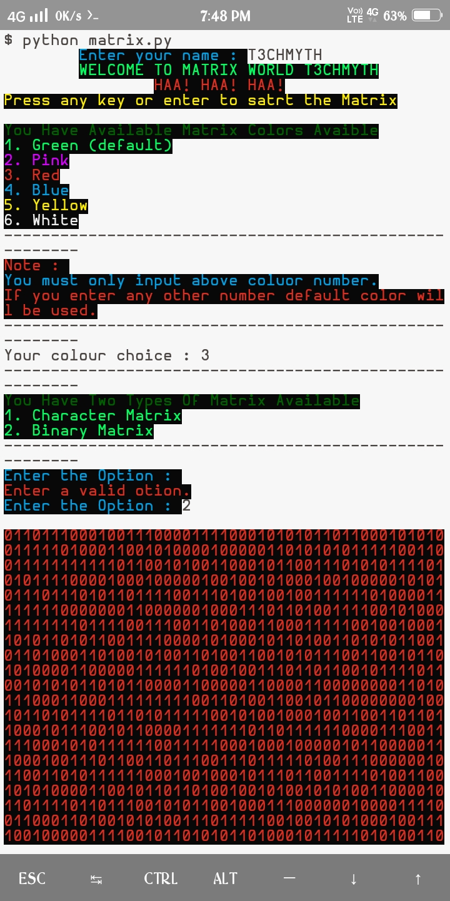
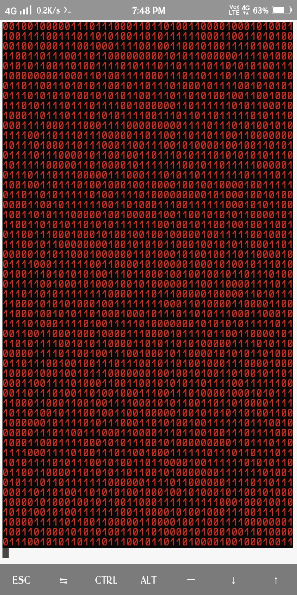

## What it is?                                                                                                         This python project allows simulate a Matrix style screen. You could configure characters used or even the speed of
the effects.

## Where it works?
It can work on following platforms
1. Termux
2. Any linux os                                                                                                        3. Windows
4. And on other platforms where python works...

But only on the cli mode...

## How it works?
It completely works on terminal and terminal emulators
Using python3

## System Install
NOTE - 
This works only on the linux system
.
You can even install it on your system

```
git clone https://github.com/T3CHMYTH/python3-matrix

```
Once the project is downloaded. You cd into the project folder and execute this to install dependencies.
```
cd python3-matrix
```
Now, Follow the following commands
```
pip install -r requirements.txt
chmod 777 matrix
chmod 777 setup.sh
./setup.sh

```
Now you have sucessfully install it on your system you can directly run it from
anywhere on you terminal just type the below command
```
matrix
```
finally, enjoy you multicolor matirx.
NOte- 
If you want to uninstall the program you can type below command
```
delmatrix
```
And then you can completed with your uninstallation.

## How to install?
You must download the project first

```
git clone https://github.com/T3CHMYTH/python3-matrix

```

Once the project is downloaded. You cd into the project folder and execute this to install dependencies

```
pip install -r requirements.txt

```
if doesn't works try

```
pip3 install -r requirements.txt

```

And you execute it:

```
python matrix.py

```

And then you can choose the options according to you.

Note-
To stop the Matrix

```
Ctrl + c

```
## Images
ScreenShort 1

ScreemShort 2

